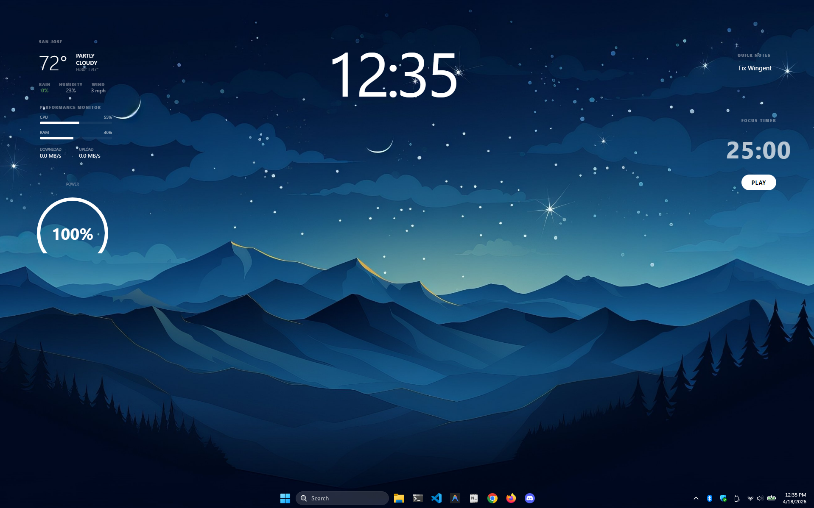

# Wingent

Desktop widget system for Windows. THIS IS NOT WINGET, that is some windows stuff



## Requirements

- [Node.js](https://nodejs.org) v18+
- [Python](https://python.org) 3.8+

## Install

Double-click `install.bat` or run it from a terminal:

```
install.bat
```

This installs dependencies and builds the app.

## Run

```
python Launch.py
```

Opens the control hub in your browser at `http://localhost:8080` and starts the widget process.

## Widgets

| Widget | Description |
|--------|-------------|
| Clock | Large typographic clock |
| System | CPU, RAM, network monitor |
| Weather | Live weather via Open-Meteo |
| Notes | Persistent sticky note |
| Timer | Countdown focus timer |
| Battery | Circular battery gauge |

## Controls

- **Hub** (`http://localhost:8080`) — toggle widgets, adjust settings, set weather city, save config
- **Drag** any widget to reposition
- **Triple Escape** or `Ctrl+Alt+Escape` — quit
- **Theme dots** on each widget — switch accent color (blue / red / green)

## Settings

Settings persist to `~/.wingent-v7-settings.json`. Use the hub to change:

- Clock size
- Glass transparency
- Weather city
- Run on startup

 ## Join our dsc https://discord.gg/SWNTxSD5fv
